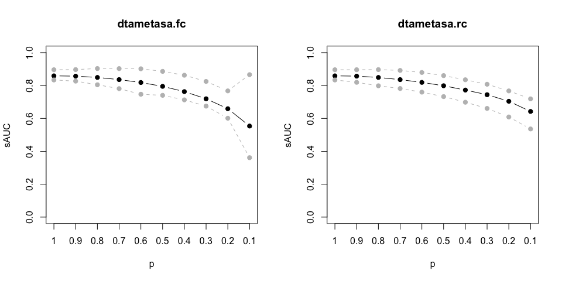

<!-- README.md is generated from README.Rmd. Please edit that file -->

# DTA-META-SA

<!-- badges: start -->

<!-- badges: end -->

The goal of `dtametasa` is to conduct sensitivity analysis on the
publication bias of meta-analysis of diagnostic test accuracy

## Installation

You can install the released version from
[GitHub](https://github.com/meta2020/dtametasa) with:

``` r
devtools::install_git("meta2020/dtametasa")
```

## Example

This is an example which shows you how to solve a common problem. To
take the data `IVD` as example, print the first several lines of data.

``` r
## Load package

library(dtametasa)

## Load data

data(IVD)
kable(head(IVD))
```

| study | TP | FN |  FP |  TN |
| ----: | -: | -: | --: | --: |
|     1 | 12 |  0 |  29 | 289 |
|     2 | 10 |  2 |  14 |  72 |
|     3 | 17 |  1 |  36 |  85 |
|     4 | 13 |  0 |  18 |  67 |
|     5 |  4 |  0 |  21 | 225 |
|     6 | 15 |  2 | 122 | 403 |

### Main function 1: dtametasa.fc

This function need to pre-specify the c contrast in the selection
function.

1.  Given a certain selection probability \(p\), say, \(p = 0.7\), we
    can get the estimation as follows.

<!-- end list -->

``` r
## Use default parameters setting
## Print parameters and profile-likelihood confidence interval

dtametasa.fc(IVD, p = 0.7)
#> $par
#>     u1     u2    t11    t22    t12      b      a    c11    c22   sauc     se 
#>  1.325  1.650  0.290  0.775 -0.164  2.000 -4.235  0.500  0.500  0.859  0.790 
#>     sp 
#>  0.839

## If we change b.interval

dtametasa.fc(IVD, p = 0.7, b.interval = c(0, 5))
#> $par
#>      u1      u2     t11     t22     t12       b       a     c11     c22    sauc 
#>   1.319   1.632   0.291   0.792  -0.160   5.000 -10.507   0.500   0.500   0.855 
#>      se      sp 
#>   0.789   0.836

## To get full results list

sa1 <- dtametasa.fc(IVD, p = 0.7)

str(sa1)
#> List of 10
#>  $ par        : Named num [1:12] 1.325 1.65 0.29 0.775 -0.164 ...
#>   ..- attr(*, "names")= chr [1:12] "u1" "u2" "t11" "t22" ...
#>  $ objective  : num 21.6
#>  $ convergence: int 0
#>  $ iterations : int 33
#>  $ evaluations: Named int [1:2] 39 238
#>   ..- attr(*, "names")= chr [1:2] "function" "gradient"
#>  $ message    : chr "relative convergence (4)"
#>  $ p.hat      : num 0.7
#>  $ data       :'data.frame': 33 obs. of  7 variables:
#>   ..$ sens  : num [1:33] 0.962 0.808 0.921 0.964 0.9 ...
#>   ..$ spec  : num [1:33] 0.908 0.833 0.701 0.785 0.913 ...
#>   ..$ y1    : num [1:33] 3.22 1.44 2.46 3.3 2.2 ...
#>   ..$ y2    : num [1:33] 2.284 1.609 0.851 1.294 2.35 ...
#>   ..$ v1    : num [1:33] 2.08 0.495 0.724 2.074 2.222 ...
#>   ..$ v2    : num [1:33] 0.0374 0.0828 0.0391 0.0689 0.0509 ...
#>   ..$ ldor.t: num [1:33] 3.78 4 3.79 3.14 3.02 ...
#>  $ func.name  : chr "dtametasa.fc"
#>  $ pars.info  :List of 12
#>   ..$ p                : num 0.7
#>   ..$ c1.sq            : num 0.5
#>   ..$ correct.value    : num 0.5
#>   ..$ correct.type     : chr "all"
#>   ..$ brem.init        : logi NA
#>   ..$ b.init           : num 0.1
#>   ..$ b.interval       : num [1:2] 0 2
#>   ..$ a.interval       : num [1:2] -3 3
#>   ..$ positive.r       : logi TRUE
#>   ..$ ci.level         : num 0.95
#>   ..$ show.warn.message: logi FALSE
#>   ..$ a.root.extendInt : chr "downX"
#>  - attr(*, "class")= chr "dtametasa"
```

2.  Given a series of selection probabilities, say,
    \(p = 1, 0.9, 0,8, ...,0.1\). Notice that, \(p\) must greater than 0
    and cannot equal to 0. (\(p>0\))

<!-- end list -->

``` r

## Set p vectors

p.seq <- seq(1, 0.1, -0.1)

## Get estimations for each p in p.seq vector

est1 <- sapply(p.seq, function(p) dtametasa.fc(IVD, p)$par)

## Print estimation

colnames(est1)<- paste0("p = ", p.seq)
kable(est1)
```

|      |   p = 1 | p = 0.9 | p = 0.8 | p = 0.7 | p = 0.6 | p = 0.5 | p = 0.4 | p = 0.3 | p = 0.2 | p = 0.1 |
| :--- | ------: | ------: | ------: | ------: | ------: | ------: | ------: | ------: | ------: | ------: |
| u1   |   1.388 |   1.383 |   1.359 |   1.325 |   1.286 |   1.246 |   1.203 |   1.147 |   1.069 |   0.932 |
| u2   |   1.804 |   1.792 |   1.737 |   1.650 |   1.541 |   1.421 |   1.279 |   1.086 |   0.796 |   0.250 |
| t11  |   0.297 |   0.298 |   0.295 |   0.290 |   0.285 |   0.281 |   0.277 |   0.275 |   0.277 |   0.287 |
| t22  |   0.671 |   0.686 |   0.726 |   0.775 |   0.834 |   0.893 |   0.957 |   1.050 |   1.194 |   1.480 |
| t12  | \-0.189 | \-0.185 | \-0.176 | \-0.164 | \-0.150 | \-0.137 | \-0.123 | \-0.103 | \-0.073 | \-0.012 |
| b    |   0.100 |   2.000 |   2.000 |   2.000 |   2.000 |   1.788 |   1.581 |   1.472 |   1.397 |   1.340 |
| a    |  10.650 | \-2.541 | \-3.597 | \-4.235 | \-4.699 | \-4.578 | \-4.384 | \-4.379 | \-4.446 | \-4.574 |
| c11  |   0.500 |   0.500 |   0.500 |   0.500 |   0.500 |   0.500 |   0.500 |   0.500 |   0.500 |   0.500 |
| c22  |   0.500 |   0.500 |   0.500 |   0.500 |   0.500 |   0.500 |   0.500 |   0.500 |   0.500 |   0.500 |
| sauc |   0.883 |   0.880 |   0.871 |   0.859 |   0.843 |   0.828 |   0.811 |   0.789 |   0.760 |   0.718 |
| se   |   0.800 |   0.799 |   0.796 |   0.790 |   0.783 |   0.777 |   0.769 |   0.759 |   0.744 |   0.718 |
| sp   |   0.859 |   0.857 |   0.850 |   0.839 |   0.824 |   0.805 |   0.782 |   0.748 |   0.689 |   0.562 |

### Main function 2: dtametasa.rc

This function do not need to pre-specify the c contrast in the selection
function.

1.  Given a certain selection probability \(p\), say, \(p = 0.7\), we
    can get the estimation as follows.

<!-- end list -->

``` r
## Use default parameters setting
## Print parameters and profile-likelihood confidence interval

dtametasa.rc(IVD, p = 0.7)
#> $par
#>     u1     u2    t11    t22    t12      b      a    c11    c22   sauc     se 
#>  1.297  1.719  0.305  0.707 -0.159  2.000 -4.257  0.514  0.486  0.860  0.785 
#>     sp 
#>  0.848

## To get full results list

sa2 <- dtametasa.rc(IVD, p = 0.7)

str(sa2)
#> List of 10
#>  $ par        : Named num [1:12] 1.297 1.719 0.305 0.707 -0.159 ...
#>   ..- attr(*, "names")= chr [1:12] "u1" "u2" "t11" "t22" ...
#>  $ objective  : num 20.9
#>  $ convergence: int 0
#>  $ iterations : int 27
#>  $ evaluations: Named int [1:2] 36 237
#>   ..- attr(*, "names")= chr [1:2] "function" "gradient"
#>  $ message    : chr "relative convergence (4)"
#>  $ p.hat      : num 0.7
#>  $ data       :'data.frame': 33 obs. of  7 variables:
#>   ..$ sens  : num [1:33] 0.962 0.808 0.921 0.964 0.9 ...
#>   ..$ spec  : num [1:33] 0.908 0.833 0.701 0.785 0.913 ...
#>   ..$ y1    : num [1:33] 3.22 1.44 2.46 3.3 2.2 ...
#>   ..$ y2    : num [1:33] 2.284 1.609 0.851 1.294 2.35 ...
#>   ..$ v1    : num [1:33] 2.08 0.495 0.724 2.074 2.222 ...
#>   ..$ v2    : num [1:33] 0.0374 0.0828 0.0391 0.0689 0.0509 ...
#>   ..$ ldor.t: num [1:33] 3.78 4 3.79 3.14 3.02 ...
#>  $ func.name  : chr "dtametasa.rc"
#>  $ pars.infor :List of 12
#>   ..$ p                : num 0.7
#>   ..$ correct.value    : num 0.5
#>   ..$ correct.type     : chr "all"
#>   ..$ brem.init        : logi NA
#>   ..$ b.init           : num 0.1
#>   ..$ c1.sq.init       : num 0.5
#>   ..$ b.interval       : num [1:2] 0 2
#>   ..$ a.interval       : num [1:2] -5 3
#>   ..$ positive.r       : logi TRUE
#>   ..$ ci.level         : num 0.95
#>   ..$ show.warn.message: logi FALSE
#>   ..$ a.root.extendInt : chr "downX"
#>  - attr(*, "class")= chr "dtametasa"
```

2.  Given a series of selection probabilities, say,
    \(p = 1, 0.9, 0,8, ...,0.1\). Notice that, \(p\) must greater than 0
    and cannot equal to 0. (\(p>0\))

<!-- end list -->

``` r
## Set p vectors

p.seq <- seq(1, 0.1, -0.1)

## Get estimations for each p in p.seq vector

est2 <- sapply(p.seq, function(p) dtametasa.rc(IVD, p)$par)

## Print estimation

colnames(est2)<- paste0("p = ", p.seq)
kable(est2)
```

|      |   p = 1 | p = 0.9 | p = 0.8 | p = 0.7 | p = 0.6 | p = 0.5 | p = 0.4 | p = 0.3 | p = 0.2 | p = 0.1 |
| :--- | ------: | ------: | ------: | ------: | ------: | ------: | ------: | ------: | ------: | ------: |
| u1   |   1.388 |   1.382 |   1.349 |   1.297 |   1.236 |   1.168 |   1.086 |   0.998 |   0.867 |   0.624 |
| u2   |   1.804 |   1.800 |   1.773 |   1.719 |   1.640 |   1.535 |   1.396 |   1.215 |   0.938 |   0.405 |
| t11  |   0.297 |   0.301 |   0.305 |   0.305 |   0.304 |   0.305 |   0.311 |   0.318 |   0.338 |   0.389 |
| t22  |   0.671 |   0.674 |   0.686 |   0.707 |   0.738 |   0.782 |   0.844 |   0.927 |   1.059 |   1.331 |
| t12  | \-0.189 | \-0.186 | \-0.175 | \-0.159 | \-0.141 | \-0.119 | \-0.089 | \-0.056 | \-0.002 |   0.112 |
| b    |   0.100 |   2.000 |   2.000 |   2.000 |   2.000 |   2.000 |   1.994 |   1.801 |   1.683 |   1.600 |
| a    |  10.650 | \-2.176 | \-3.440 | \-4.257 | \-4.870 | \-5.352 | \-5.723 | \-5.566 | \-5.537 | \-5.580 |
| c11  |   0.250 |   0.615 |   0.558 |   0.514 |   0.477 |   0.450 |   0.431 |   0.408 |   0.393 |   0.378 |
| c22  |   0.750 |   0.385 |   0.442 |   0.486 |   0.523 |   0.550 |   0.569 |   0.592 |   0.607 |   0.622 |
| sauc |   0.883 |   0.881 |   0.873 |   0.860 |   0.843 |   0.820 |   0.789 |   0.754 |   0.705 |   0.637 |
| se   |   0.800 |   0.799 |   0.794 |   0.785 |   0.775 |   0.763 |   0.748 |   0.731 |   0.704 |   0.651 |
| sp   |   0.859 |   0.858 |   0.855 |   0.848 |   0.838 |   0.823 |   0.802 |   0.771 |   0.719 |   0.600 |

### Plot sROC

1.  Single sROC

<!-- end list -->

``` r
par(mfrow = c(1,2))

## This is the standard method: Reistma model
## Without taking publication bias (PB) into consideration

library(mada)
#> Loading required package: mvtnorm
#> Loading required package: ellipse
#> 
#> Attaching package: 'ellipse'
#> The following object is masked from 'package:graphics':
#> 
#>     pairs
#> Loading required package: mvmeta
#> This is mvmeta 1.0.3. For an overview type: help('mvmeta-package').
fit <- reitsma(IVD, correction.control = "all", method = "ml")
plot(sroc(fit, type = "naive"), type = "l", ylim = c(0,1), xlim = c(0,1), col = "red")
title("Reistma model from mada")

## Extact the estimation from Reistma model

par0 <- c(c(1,-1)*fit$coefficients, c(1,-1)*fit$Psi[c(4,3)])

## Our model that takes PB into consideration

# sa1 <- dtametasa.fc(IVD, p = 0.5)
# sa2 <- dtametasa.rc(IVD, p = 0.5)

## Plot ROC from Reistma model
sROC(par0, roc.col = "red", spoint.col ="red")

## Add sROC
sROC(sa1, add = TRUE, roc.col = "black", roc.lty = 2, spoint.pch = 1, spoint.col = "black")
sROC(sa2, add = TRUE, roc.col = "darkgray", roc.lty = 2, spoint.col = "darkgray")

## Also works by using the extracted parameters, but attention the pars

par1 <- sa1$par[c(1,2,4,5)]
par2 <- sa2$par[c(1,2,4,5)]
sROC(par1, add = TRUE, roc.col = "black", roc.lty = 2, spoint.pch = 1, spoint.col = "black")
sROC(par2, add = TRUE, roc.col = "darkgray", roc.lty = 2, spoint.col = "darkgray")

## Calculate the data points (fpr, sens) of IVD

with(IVD, points(FP/(FP+TN), TP/(TP+FN), pch = 4, cex = 0.5))
legend("bottomright", c("Reistma", "dtametasa.fc", "dtametasa.rc", "IVD"), 
       col = c("red", "black", "darkgray", "black"), lty = c(1,2,2, 0), pch = c(19,1,19, 4))
title("When selection prob = 0.0.5")
```


``` r
par(mfrow = c(1,1))
```

2.  Multiple sROC

<!-- end list -->

``` r
## p vector and model

# p.seq <- seq(1, 0.1, -0.1)
# est1 <- sapply(p.seq, function(p) dtametasa.fc(IVD, p)$par)
# est2 <- sapply(p.seq, function(p) dtametasa.rc(IVD, p)$par)

## Plot multiple sROC
par(mfrow = c(1,2))
sROC.matrix(est1[c(1,2,4,5), ], legend = TRUE, p.vec = p.seq, legend.cex = 0.5)
sROC(par0, add = TRUE, roc.col = "red")
title("dtametasa.fc")

sROC.matrix(est2[c(1,2,4,5), ], legend = TRUE, p.vec = p.seq, legend.cex = 0.5)
sROC(par0, add = TRUE, roc.col = "red")
title("dtametasa.rc")
```


``` r
par(mfrow = c(1,1))
```

### Calculate sAUC and confident interval

Although sAUC has output together with the parameters in `dtametasa.fc`
and `dtametasa.rc` functions. We can still calculate by using `sAUC`
function.

The confidence interval (CI) is calculated by parametric bootstrapping.
To save computing time, we set bootstrapping times as 5 (`B = 5`). Hence
the results are not reliable.

#### 1\. Single sROC

``` r

## Use parameter vector
par1 <- sa1$par
par2 <- sa2$par
sAUC(par1[c(1,2,4,5)])
#> [1] 0.836
sAUC(par2[c(1,2,4,5)])
#> [1] 0.836


par(mfrow = c(1,2))

sROC(sa1)
title("dtametasa.fc")
sROC(sa2)
title("dtametasa.rc")
```


``` r

par(mfrow = c(1,1))
```

#### 2\. Single sROC with CI

``` r

## Calculate Parametric Bootstrap CI
## B (Bootstrapping times) is suggested to be 1000. To save computing time, we use B = 10 to show the functionality.
par(mfrow = c(1,2))

sAUC.ci(sa1, B=5, plot.ROC.ci = TRUE, hide.progress = TRUE)
#>  sauc  ci.l  ci.u 
#> 0.859 0.792 0.894
title("dtametasa.fc")
sAUC.ci(sa2, B=5, plot.ROC.ci = TRUE, hide.progress = TRUE)
#>  sauc  ci.l  ci.u 
#> 0.860 0.812 0.881
title("dtametasa.rc")
```


``` r

par(mfrow = c(1,1))
```

#### 3\. Multiple sAUC

``` r

## Calculate Parametric Bootstrap CI

## B (Bootstrapping times) is suggested to be 1000. To save computing time, we use B = 5 to show the functionality.

p.seq <- seq(1, 0.1, -0.1)

sauc1 <- sapply(p.seq, function(p) {
  sa1 <- dtametasa.fc(IVD, p)
  sauc <- sAUC.ci(sa1, B=5, hide.progress = TRUE)
  c(sauc[[1]], sauc[[2]], sauc[[3]])
  })


sauc2 <- sapply(p.seq, function(p) {
  sa2 <- dtametasa.rc(IVD, p)
  sauc <- sAUC.ci(sa2, B=5, hide.progress = TRUE)
  c(sauc[[1]], sauc[[2]], sauc[[3]])
  })

colnames(sauc1)<- paste0("p = ", p.seq)
rownames(sauc1)<- c("sAUC", "CI.L", "CI.U")
kable(sauc1)
```

|      | p = 1 | p = 0.9 | p = 0.8 | p = 0.7 | p = 0.6 | p = 0.5 | p = 0.4 | p = 0.3 | p = 0.2 | p = 0.1 |
| :--- | ----: | ------: | ------: | ------: | ------: | ------: | ------: | ------: | ------: | ------: |
| sAUC | 0.883 |   0.880 |   0.871 |   0.859 |   0.843 |   0.828 |   0.811 |   0.789 |   0.760 |   0.718 |
| CI.L | 0.869 |   0.825 |   0.816 |   0.828 |   0.821 |   0.795 |   0.731 |   0.738 |   0.686 |   0.435 |
| CI.U | 0.904 |   0.935 |   0.909 |   0.893 |   0.892 |   0.855 |   0.898 |   0.867 |   0.918 |   0.889 |

``` r

colnames(sauc2)<- paste0("p = ", p.seq)
rownames(sauc2)<- c("sAUC", "CI.L", "CI.U")
kable(sauc2)
```

|      | p = 1 | p = 0.9 | p = 0.8 | p = 0.7 | p = 0.6 | p = 0.5 | p = 0.4 | p = 0.3 | p = 0.2 | p = 0.1 |
| :--- | ----: | ------: | ------: | ------: | ------: | ------: | ------: | ------: | ------: | ------: |
| sAUC | 0.883 |   0.881 |   0.873 |   0.860 |   0.843 |   0.820 |   0.789 |   0.754 |   0.705 |   0.637 |
| CI.L | 0.835 |   0.843 |   0.819 |   0.810 |   0.774 |   0.742 |   0.552 |   0.482 |   0.556 |   0.535 |
| CI.U | 0.923 |   0.910 |   0.908 |   0.931 |   0.912 |   0.867 |   1.000 |   0.916 |   0.887 |   0.781 |

#### 4\. Plot sAUC

This is an example of how to plot sAUC and CI. In analysis, please set
`B = 1000` and then reproduce the plots.

``` r
par(mfrow = c(1,2))

## Use matplot to plot the sAUC and CI

matplot(t(sauc1), type = "b", lty = c(1,2,2), 
        pch = 19, col = c("black", "grey", "grey"),
        xlab = "p", ylab = "sAUC",
        ylim = c(0,1),
        xaxt = "n")
axis(1, at = 1:10, labels = p.seq)
title("dtametasa.fc")

matplot(t(sauc2), type = "b", lty = c(1,2,2), 
        pch = 19, col = c("black", "grey", "grey"),
        xlab = "p", ylab = "sAUC",
        ylim = c(0,1),
        xaxt = "n")
axis(1, at = 1:10, labels = p.seq)
title("dtametasa.rc")
```



``` r

par(mfrow = c(1,1))
```
