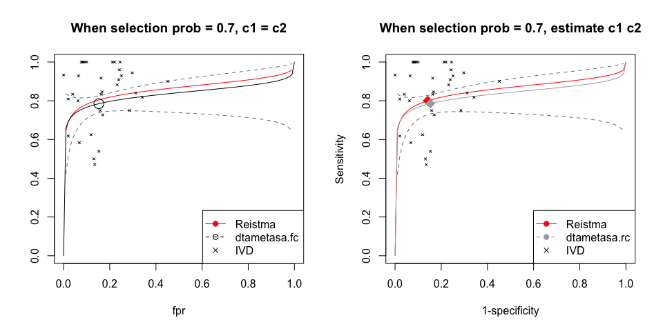

<!-- README.md is generated from README.Rmd. Please edit that file -->
[](https://github.com/meta2020/dtametasa/archive/refs/heads/main.zip)

# DTA-META-SA

<!-- badges: start -->
<!-- badges: end -->

The goal of `dtametasa` is to conduct sensitivity analysis on the
publication bias of meta-analysis of diagnostic test accuracy

## Installation

You can install the released version from
[GitHub](https://github.com/meta2020/dtametasa) with:

``` r
# install.packages("devtools")
devtools::install_github("meta2020/dtametasa")
```

## Data Format

Two formats of data are applicable:

-   Number of TP/FN/FP/TN

-   After logit transformation: y1/y2/v1/v2

<span style="color:red">**Attention: the column names of data must be
either of the above.**</span>

## Example

This is an example which shows you how to solve a common problem.

To take the data `IVD` as example, print the first several lines of
data.

``` r
## Load package

library(dtametasa)

## Load data

data(IVD)
kable(head(IVD))
```

| study |  TP |  FN |  FP |  TN |
|------:|----:|----:|----:|----:|
|     1 |  12 |   0 |  29 | 289 |
|     2 |  10 |   2 |  14 |  72 |
|     3 |  17 |   1 |  36 |  85 |
|     4 |  13 |   0 |  18 |  67 |
|     5 |   4 |   0 |  21 | 225 |
|     6 |  15 |   2 | 122 | 403 |

``` r

data(IVD2)
kable(head(IVD2))
```

|  sens |  spec |   y1 |    y2 |    v1 |    v2 | ldor.t |
|------:|------:|-----:|------:|------:|------:|-------:|
| 0.962 | 0.908 | 3.22 | 2.284 | 2.080 | 0.037 |   3.78 |
| 0.808 | 0.833 | 1.44 | 1.609 | 0.495 | 0.083 |   4.00 |
| 0.921 | 0.701 | 2.46 | 0.851 | 0.724 | 0.039 |   3.79 |
| 0.964 | 0.785 | 3.30 | 1.294 | 2.074 | 0.069 |   3.14 |
| 0.900 | 0.913 | 2.20 | 2.350 | 2.222 | 0.051 |   3.02 |
| 0.861 | 0.767 | 1.82 | 1.192 | 0.465 | 0.011 |   4.38 |

### Main function 1: dtametasa.fc

This function need to pre-specify the c contrast in the selection
function.

##### 1. Given a certain selection probability *p*, say, *p* = 0.7, we can get the estimation as follows.

``` r
## Use default parameters setting
## Print parameters' estimates

(sa1 <- dtametasa.fc(IVD, p = 0.7, b.interval = c(0, 2)))
#> $par.all
#>     u1     u2    t11    t22    t12     c1     c2      b      a   sauc     se 
#>  1.299  1.717  0.304  0.709 -0.159  0.707  0.707  2.000 -4.308  0.836  0.786 
#>     sp 
#>  0.848

## If we change b.interval

(sa1 <- dtametasa.fc(IVD, p = 0.7, b.interval = c(0, 5)))
#> $par.all
#>      u1      u2     t11     t22     t12      c1      c2       b       a    sauc 
#>   1.295   1.713   0.306   0.712  -0.157   0.707   0.707   5.000 -10.760   0.835 
#>      se      sp 
#>   0.785   0.847

## Use str() to get full results list

# str(sa1)
```

##### 2. Given a series of selection probabilities, say, *p* = 1, 0.9, 0, 8, ..., 0.1.

Attention: ***p* must greater than 0 and cannot equal to 0.
(*p* &gt; 0).**

``` r
## Set p vectors

p.seq <- seq(1, 0.1, -0.1)

## Get estimations for each p in p.seq vector

est1 <- sapply(p.seq, function(p) dtametasa.fc(IVD, p, b.interval = c(0, 2))$par.all)

## Print estimation

colnames(est1)<- paste0("p = ", p.seq)
kable(est1)
```

|      |  p = 1 | p = 0.9 | p = 0.8 | p = 0.7 | p = 0.6 | p = 0.5 | p = 0.4 | p = 0.3 | p = 0.2 | p = 0.1 |
|:-----|-------:|--------:|--------:|--------:|--------:|--------:|--------:|--------:|--------:|--------:|
| u1   |  1.388 |   1.383 |   1.352 |   1.299 |   1.230 |   1.146 |   1.040 |   0.902 |   0.707 |   0.322 |
| u2   |  1.804 |   1.799 |   1.769 |   1.717 |   1.645 |   1.553 |   1.430 |   1.267 |   1.036 |   0.584 |
| t11  |  0.297 |   0.300 |   0.303 |   0.304 |   0.307 |   0.315 |   0.334 |   0.367 |   0.421 |   0.555 |
| t22  |  0.671 |   0.676 |   0.690 |   0.709 |   0.734 |   0.767 |   0.816 |   0.884 |   0.980 |   1.178 |
| t12  | -0.189 |  -0.186 |  -0.175 |  -0.159 |  -0.140 |  -0.114 |  -0.079 |  -0.029 |   0.044 |   0.204 |
| c1   |  0.707 |   0.707 |   0.707 |   0.707 |   0.707 |   0.707 |   0.707 |   0.707 |   0.707 |   0.707 |
| c2   |  0.707 |   0.707 |   0.707 |   0.707 |   0.707 |   0.707 |   0.707 |   0.707 |   0.707 |   0.707 |
| b    |  1.000 |   2.000 |   2.000 |   2.000 |   2.000 |   2.000 |   2.000 |   1.915 |   1.759 |   1.674 |
| a    | 18.330 |  -2.556 |  -3.647 |  -4.308 |  -4.781 |  -5.151 |  -5.456 |  -5.507 |  -5.353 |  -5.358 |
| sauc |  0.859 |   0.857 |   0.849 |   0.836 |   0.819 |   0.795 |   0.763 |   0.720 |   0.659 |   0.554 |
| se   |  0.800 |   0.799 |   0.794 |   0.786 |   0.774 |   0.759 |   0.739 |   0.711 |   0.670 |   0.580 |
| sp   |  0.859 |   0.858 |   0.854 |   0.848 |   0.838 |   0.825 |   0.807 |   0.780 |   0.738 |   0.642 |

### Main function 2: dtametasa.rc

This function do not need to pre-specify the c contrast in the selection
function.

##### 1. Given a certain selection probability *p*, say, *p* = 0.7, we can get the estimation as follows.

``` r
## Use default parameters setting
## Print parameters' estimates

(sa2 <- dtametasa.rc(IVD, p = 0.7))
#> $par.all
#>     u1     u2    t11    t22    t12     c1     c2      b      a   sauc     se 
#>  1.297  1.719  0.305  0.707 -0.159  0.717  0.697  2.000 -4.257  0.836  0.785 
#>     sp 
#>  0.848

## To get full results list

# str(sa2)
```

##### 2. Given a series of selection probabilities, say, *p* = 1, 0.9, 0, 8, ..., 0.1.

Attention: ***p* must greater than 0 and cannot equal to 0.
(*p* &gt; 0).**

``` r
## Set p vectors

p.seq <- seq(1, 0.1, -0.1)

## Get estimations for each p in p.seq vector

est2 <- sapply(p.seq, function(p) dtametasa.rc(IVD, p, b.interval = c(0, 2))$par.all)

## Print estimation

colnames(est2)<- paste0("p = ", p.seq)
kable(est2)
```

|      |  p = 1 | p = 0.9 | p = 0.8 | p = 0.7 | p = 0.6 | p = 0.5 | p = 0.4 | p = 0.3 | p = 0.2 | p = 0.1 |
|:-----|-------:|--------:|--------:|--------:|--------:|--------:|--------:|--------:|--------:|--------:|
| u1   |  1.388 |   1.382 |   1.349 |   1.297 |   1.236 |   1.168 |   1.086 |   0.998 |   0.867 |   0.624 |
| u2   |  1.804 |   1.800 |   1.773 |   1.719 |   1.640 |   1.535 |   1.396 |   1.215 |   0.938 |   0.405 |
| t11  |  0.297 |   0.301 |   0.305 |   0.305 |   0.304 |   0.305 |   0.311 |   0.318 |   0.338 |   0.389 |
| t22  |  0.671 |   0.674 |   0.686 |   0.707 |   0.738 |   0.782 |   0.844 |   0.927 |   1.059 |   1.331 |
| t12  | -0.189 |  -0.186 |  -0.175 |  -0.159 |  -0.141 |  -0.119 |  -0.089 |  -0.056 |  -0.002 |   0.112 |
| c1   |  0.707 |   0.784 |   0.747 |   0.717 |   0.691 |   0.671 |   0.657 |   0.639 |   0.627 |   0.615 |
| c2   |  0.707 |   0.621 |   0.665 |   0.697 |   0.723 |   0.742 |   0.754 |   0.769 |   0.779 |   0.789 |
| b    |  1.000 |   2.000 |   2.000 |   2.000 |   2.000 |   2.000 |   1.994 |   1.801 |   1.683 |   1.600 |
| a    | 18.330 |  -2.176 |  -3.440 |  -4.257 |  -4.870 |  -5.352 |  -5.723 |  -5.566 |  -5.537 |  -5.580 |
| sauc |  0.859 |   0.857 |   0.849 |   0.836 |   0.819 |   0.799 |   0.773 |   0.744 |   0.704 |   0.643 |
| se   |  0.800 |   0.799 |   0.794 |   0.785 |   0.775 |   0.763 |   0.748 |   0.731 |   0.704 |   0.651 |
| sp   |  0.859 |   0.858 |   0.855 |   0.848 |   0.838 |   0.823 |   0.802 |   0.771 |   0.719 |   0.600 |

### Plot sROC

##### 1. Single sROC

``` r
par(mfrow = c(1,2))

## This is the standard method: Reistma model
## Without taking publication bias (PB) into consideration

library(mada)
#> Loading required package: mvtnorm
#> Loading required package: ellipse
#> 
#> Attaching package: 'ellipse'
#> The following object is masked from 'package:graphics':
#> 
#>     pairs
#> Loading required package: mvmeta
#> This is mvmeta 1.0.3. For an overview type: help('mvmeta-package').
fit <- reitsma(IVD, correction.control = "all", method = "ml")
plot(sroc(fit, type = "naive"), type = "l", ylim = c(0,1), xlim = c(0,1), col = "red")

## Extact the estimation from Reistma model

par0 <- c(c(1,-1)*fit$coefficients, sqrt(fit$Psi[c(1,4)]), -fit$Psi[2]/prod(sqrt(fit$Psi[c(1,4)])))

## Add sROC
sROC(sa1, add = TRUE, sroc.col = "black", sroc.lty = 1, spoint.pch = 1, spoint.col = "black")
with(IVD, points(FP/(FP+TN), TP/(TP+FN), pch = 4, cex = 0.5))
legend("bottomright", c("Reistma", "dtametasa.fc", "IVD"), 
       col = c("red", "black", "black"), lty = c(1,2, 0), pch = c(19,1, 4))
title("When selection prob = 0.7, c1 = c2")


sROC(par0, sroc.col = "red", spoint.col ="red")

## Add sROC
sROC(sa2, add = TRUE, sroc.col = "darkgray", sroc.lty = 1, spoint.col = "darkgray")

with(IVD, points(FP/(FP+TN), TP/(TP+FN), pch = 4, cex = 0.5))
legend("bottomright", c("Reistma", "dtametasa.rc", "IVD"), 
       col = c("red", "darkgray", "black"), lty = c(1, 2, 0), pch = c(19,19, 4))
title("When selection prob = 0.7, estimate c1 c2")
```



``` r
par(mfrow = c(1,1))
```

##### 2. Multiple sROC

``` r
## p vector and model

p.seq <- seq(1, 0.1, -0.1)
est1 <- sapply(p.seq, function(p) dtametasa.fc(IVD, p)$par)
est2 <- sapply(p.seq, function(p) dtametasa.rc(IVD, p)$par)

## Plot multiple sROC
par(mfrow = c(1,2))

sROC.matrix(est1[1:5, ])
sROC(par0, add = TRUE, sroc.col = "red")
title("dtametasa.fc")

sROC.matrix(est1[1:5, ])
sROC(par0, add = TRUE, sroc.col = "red")
title("dtametasa.rc")
```


``` r

par(mfrow = c(1,1))
```

### Calculate sAUC and confident interval

#### 1. Single sROC with CI

``` r
## Use parameter vector
sa1 <- dtametasa.fc(IVD, p = 0.5, b.interval = c(0, 2))
sa2 <- dtametasa.rc(IVD, p = 0.5, b.interval = c(0, 2))

par(mfrow = c(1,2))

sROC(sa1)
title("dtametasa.fc")
sROC(sa2)
title("dtametasa.rc")
```


``` r
par(mfrow = c(1,1))
```

#### 2. Multiple sAUC

``` r

p.seq <- seq(1, 0.1, -0.1)

sauc1 <- sapply(p.seq, function(p) dtametasa.fc(IVD, p)$sauc.ci)
sauc2 <- sapply(p.seq, function(p) dtametasa.rc(IVD, p)$sauc.ci)

colnames(sauc1)<- paste0("p = ", p.seq)
kable(sauc1)
```

|         | p = 1 | p = 0.9 | p = 0.8 | p = 0.7 | p = 0.6 | p = 0.5 | p = 0.4 | p = 0.3 | p = 0.2 | p = 0.1 |
|:--------|------:|--------:|--------:|--------:|--------:|--------:|--------:|--------:|--------:|--------:|
| sauc    | 0.859 |   0.857 |   0.849 |   0.836 |   0.819 |   0.795 |   0.763 |   0.720 |   0.659 |   0.554 |
| sauc.lb | 0.790 |   0.787 |   0.774 |   0.754 |   0.723 |   0.680 |   0.617 |   0.535 |   0.438 |   0.307 |
| sauc.ub | 0.908 |   0.907 |   0.902 |   0.895 |   0.886 |   0.876 |   0.865 |   0.851 |   0.828 |   0.777 |

``` r
colnames(sauc2)<- paste0("p = ", p.seq)
kable(sauc2)
```

|         | p = 1 | p = 0.9 | p = 0.8 | p = 0.7 | p = 0.6 | p = 0.5 | p = 0.4 | p = 0.3 | p = 0.2 | p = 0.1 |
|:--------|------:|--------:|--------:|--------:|--------:|--------:|--------:|--------:|--------:|--------:|
| sauc    | 0.859 |   0.857 |   0.849 |   0.836 |   0.819 |   0.799 |   0.773 |   0.744 |   0.704 |   0.643 |
| sauc.lb | 0.790 |   0.787 |   0.774 |   0.753 |   0.721 |   0.681 |   0.629 |   0.578 |   0.499 |   0.379 |
| sauc.ub | 0.908 |   0.907 |   0.903 |   0.895 |   0.888 |   0.881 |   0.872 |   0.861 |   0.851 |   0.841 |

#### 4. Plot sAUC

This is an example of how to plot sAUC and CI. In analysis, please set
`B = 1000` and then reproduce the plots.

``` r
par(mfrow = c(1,2))

## Use matplot to plot the sAUC and CI

matplot(t(sauc1), type = "b", lty = c(1,2,2), 
        pch = 19, col = c("black", "grey", "grey"),
        xlab = "p", ylab = "sAUC",
        ylim = c(0,1),
        xaxt = "n")
axis(1, at = 1:10, labels = p.seq)
title("dtametasa.fc")

matplot(t(sauc2), type = "b", lty = c(1,2,2), 
        pch = 19, col = c("black", "grey", "grey"),
        xlab = "p", ylab = "sAUC",
        ylim = c(0,1),
        xaxt = "n")
axis(1, at = 1:10, labels = p.seq)
title("dtametasa.rc")
```


``` r
par(mfrow = c(1,1))
```
